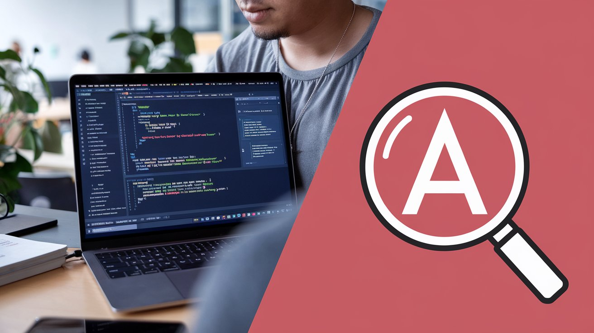

<h1 align="center">Vídeos</h1>

Este repositório contém vídeos educativos com dicas, aulas e tutoriais sobre tecnologia criados por mim.

<table align="center">
  <thead>
    <tr>
      <th>Título</th>
      <th>Data</th>
      <th>Thumbnail</th>
    </tr>
  </thead>
  <tbody>
    <tr>
      <td><a href="./3/">Por que Projetos de Software Quebram? Tudo começa aqui.</a></td>
      <td>07/07/2025</td>
      <td></td>
    </tr>
    <tr>
      <td><a href="./2/">Como Melhorar Suas Buscas no Angular com Fuse.js</a></td>
      <td>18/12/2024</td>
      <td></td>
    </tr>
    <tr>
      <td><a href="./1/">Orientação a Objetos vs. Funcional: Qual Escolher?</a></td>
      <td>20/12/2024</td>
      <td></td>
    </tr>
  </tbody>
</table>
